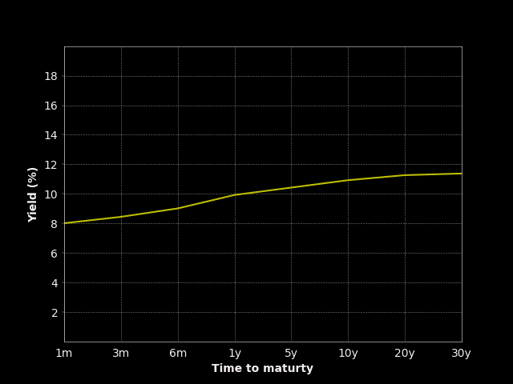

# Animated Yield Curve

Whether you trade your own small account, or manage hundreds of billions of dollars of investor money, the economy matters. The economy helps you know which way to be biased—bullish or bearish.

How do you form a view?

- Buy an analyst report

- Read “expert” commentary

- Do what most people do, guess

None of these options sounds really great.

Unfortunately, small investors don’t have teams of economists to research and give guidance on the economic picture.

I am going to show you how to build an animated chart of the yield curve to form a view of state of the economy.

The yield curve is a plot of the yield of different key US treasuries against their maturity. The yield curve provides important insight into investors’ predictions about the economy. “Inverted” yield curves have been shown to reliably predict recessions.

Normally, longer-dated treasuries yield more than shorter-dated ones. This is because there is more risk in lending money for longer. When the yield curve inverts, longer-dated treasuries yield less than shorter-dated ones. This happens when the market expects the Fed to lower interest rates in the future in anticipation of a recession.

Investors use an inverted yield curve as a sign to reduce risk in their portfolios.

You can build an animated chart of the US yield curve to form a view of the macroeconomic state.

---

## Requirements

    Python 3.6 or later
    NumPy
    Matplotlib
    OpenBB SDK
    FRED API key

---

# Setup

## Imports and set up

- Start with importing the require libraries NumPy, Matplotlib, and the OpenBB SDK. You can use the OpenBB SDK to get yield curve data for the St. Louis Fed’s data portal (FRED). To use the data, you need free FRED API keys.

- Set up the bond maturities you want to use to build the yield curve. There are conventions about which maturities to use, but there is no “right” answer. The point is to get a good representation across the maturities.

- Use the OpenBB SDK to acquire the rate data for all the maturities at once. Using the nominal instrument type returns the coupon rate (non-inflation adjusted) on the bond. Mark the yield curve as inverted if the yield on the 30-year maturity is less than the 3-month maturity. Some people use the 30-year and the 10-year, or the 10-year and the 3-month. Use what makes sense to you based on your analysis.

---

## Build the animated chart  

Animated charts offer a great way to visualize how data changes through time. 

First, set up the plots. This boilerplate code sets up the figure, creates the tick ranges and labels, and sets the axis labels. 

Next, build the animation functions.
The first function sets the initial state of the chart. The animate function grabs the data to plot, changes the curve color to red when the yield curve is inverted, and sets the data. The FuncAnimation function then does the work of looping through each row of data, creating the plot, and displaying it to you.

---

---

## Interpret the yield chart

To interpret the yield curve chart, you can look at the shape of the curve and whether it is inverted or not. Normally, the yield curve slopes upward, meaning that longer-term bonds have higher yields than shorter-term bonds. This makes sense, as investors demand a higher return for holding bonds with longer maturities, which carry more risk. However, when the yield curve becomes inverted, it means that short-term bonds have higher yields than long-term bonds. This inversion is typically viewed as a warning sign for the economy, as it suggests that investors are predicting a future downturn.

The yield curve chart in the README is an animated chart, which shows how the yield curve changes over time. The chart displays the yields for different maturities on the x-axis and the corresponding interest rates on the y-axis. The chart also includes a line that marks the inversion point, which is when the yield on the longer-term bond becomes lower than the yield on the shorter-term bond.

The chart's animation allows you to see how the yield curve evolves over time and how it may be affected by changes in economic conditions, such as changes in monetary policy. The chart's color changes to red when the yield curve is inverted, providing a clear visual signal for when an inversion occurs. Overall, the yield curve chart can help you gain insight into market expectations for the future direction of the economy and may be useful in forming investment strategies.

---

## Usage

- Clone or download the repository.
- Replace "inert_your_api_key_here" with your FRED API key in the script.
- Run the script.

The animated chart will display in the Matplotlib interactive window. You can adjust the chart settings and animation parameters in the script to suit your needs.

When you run the code, you’ll see how the yield curve evolves over time. When it flashes red, it’s inverted. You can also see the overall level of interest rates and how they rose and fell over the same time period.

---

**Note**

To obtain a FRED API key, you need to follow these steps:

- Go to the FRED API website at https://fred.stlouisfed.org/

- Click on the "Get API key" button on the top right corner of the page.

- Follow the instructions to create a FRED account or sign in to your existing account.

- Once you are signed in, you can create a new API key by clicking on the "Create API key" button.

- Enter a name for your API key and select the level of access you want to grant (e.g., "ALFRED" access for historical data).

- Click on the "Generate API key" button to create your key.

Once you have your API key, you need to save it in a separate file called config.py, which should be located in the same directory as your - Python script. The config.py file should contain a single line of code:

    FREDAPI = "your-api-key-goes-here"
    
Replace "your-api-key-goes-here" with your actual API key, enclosed in quotes.    

---

